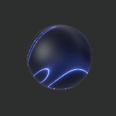

# SGM (Shader Graph Material) Examples in visionOS

A collection of Shader Graph Material (SGM) in visionOS.

- Build: Xcode 15.4, macOS 14.5 Sonoma
- Target: visionOS 1.2 (Device or Simulator)

This project shows some SGM examples, which were created with Reality Composer Pro.
Some of them are based on Satoshi's MSL (Metal Shading Language) Examples. (Thank you so much, Satoshi!)

Examples:

1.  [Basic] Color Ball
1. [Advanced] Blue Lines
1. [Advanced] Blue and Green Lines
1.  [Advanced] Edge Filter
1.  [Advanced] Ripple
1.  [Advanced] Ripple 2
1.  [Basic] Fresnel Effect
1.  [Basic] Fresnel Effect 2
1.  [Basic] Transition Animation - Wipe
1.  [Basic] Transition Animation - Dissolve
1.  [Basic] Fresnel Effect 3
1.  [Basic] Gaseous Movement (3d Fractal Noise)
1.  [Basic] Glass Ball (Environment Specular Radiance)
1.  [Basic] Wave Animation (Caustics with WorleyNoise)
1.  [Basic] Water Fog (Adjusted according to water depth)
1.  [Basic] One-time Dissolve (not repeating)
1.  [Basic] Directional Lighting (Lambert diffuse reflection + Phong Specular reflection + Ambient Light)
1.  [Basic] Rim Lighting (Backlit)
1.  [Basic] Height map morphing (Height map with 3D Perlin Noise)
1.  [Basic] Distortion Effect (uv shifting with 3D Perlin Noise)
1.  [Basic] Artistic blur filter (uv shifting with 3D Perlin Noise)
1.  [Basic] Simple Parallax on WorleyNoise
1.  [Basic] Plane polygon river (Flowing river with texture animation)
1. [Basic] Swaying Grass (swaying plane polygon grass)
1.  [Basic] Volumetric Shader (Using multiple planes and 3D Fractal Noise)

<!--
## Examples
-->

<!-- Ex.01: -->
<!--

 Ex.01: xxxx (Click to expand) 

description...

description...

description...

-->

<!-- Ex.02: -->
<!--

 Ex.02: xxxx (Click to expand) 

description...

description...

description...

-->

## Materials

- HDRI: Oliksiy Yakovlyev, Artist Workshop [Poly Heaven](https://polyhaven.com/a/artist_workshop) 
- Rock Texture Image: Granite 5 PBR Material [Free PBR](https://freepbr.com/materials/granite-5-pbr/)
- Grass illustration: Garden Grass Collection [Designed by Freepik](http://www.freepik.com)

## References

- Satoshi's MSLExamples [GitHub](https://github.com/satoshi0212/MSLExamples)
- Shader Graph Node Overview [GitHub](https://github.com/ynagatomo/evolution-Metal-ARKit-RealityKit-sheet)
- Article: ShaderGraph in visionOS (Jan 6, 2024) [Medium](https://levelup.gitconnected.com/shadergraph-in-visionos-45598e49626c)

## License

